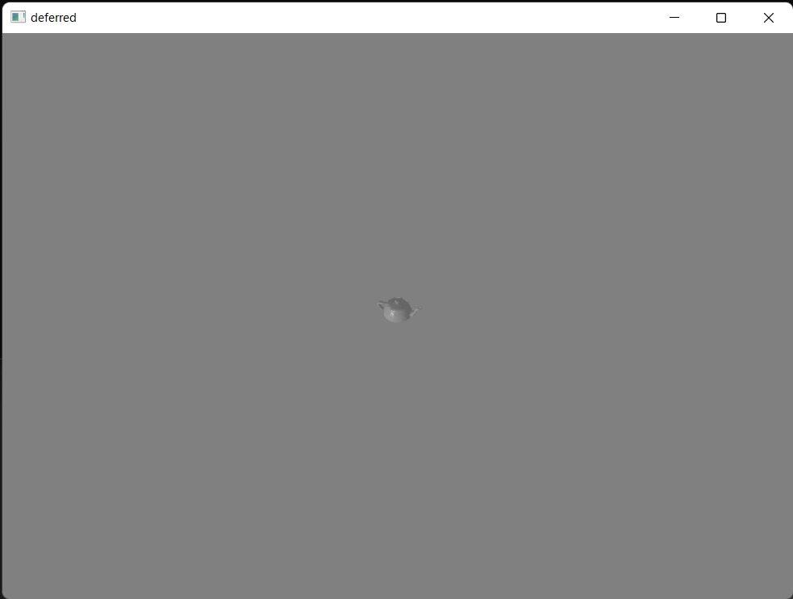
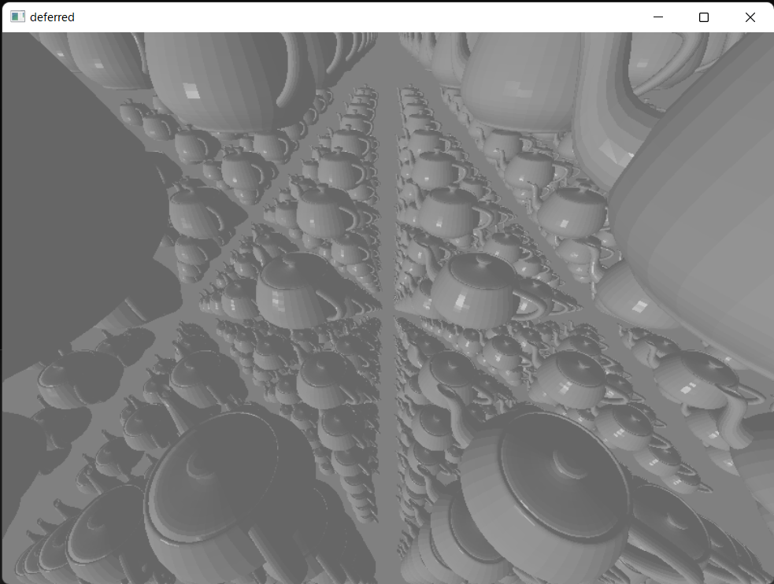

# directx12-forward-vs-deferred

## 概要

フォーワードレンダリングとディファードレンダリングの性能の調査を行う

## 描画シーン

下記のシーンにポイントライトのライティングを行っていく

* 描画モデル1体の場合



* 描画モデル1000体の場合



## 実験内容

それぞれの環境においてモデルの数、ライトの数をそれぞれ変更しfpsを計測する

## 実験その１

### 実験環境

CPU: Intel Core i5-8250U

GPU: Intel UHD Graphics 620

「Release」「x86」でビルドし時間を計測

### 描画モデル1体(1000フレーム計測しfpsを算出)

|  ライトの数 | fowardのfps |  deferredのfps  | 
| ---- | ---- | ---- |
| 1 | 64.0943 | 61.5195 | 
|  10  | 65.2146 | 61.1396 | 
|  100  | 63.362 | 61.512 | 
|  1000  | 60.024 | 60.757 | 

### 描画モデル1000体(1000フレーム計測しfpsを算出)

|  ライトの数 | fowardのfps |  deferredのfps  | 
| ---- | ---- | ---- |
| 1 | 16.2935 | 19.906 | 
|  10  | 14.9598 | 19.891 | 
|  100  | 3.98785 | 14.9692 | 
|  1000  | 1.24912 | 6.15385 | 

## 実験その2

### 実験環境

CPU: 12th Gen Intel Core i9-12900K

GPU: NVIDIA GeForce RTX 4090

「Release」「x86」でビルドし時間を計測

また、ウィンドウが出現する際の演出でFPSが安定しないため計測フレームは5000にした

### 描画モデル1体(5000フレーム計測しfpsを算出)

|  ライトの数 | fowardのfps |  deferredのfps  | 
| ---- | ---- | ---- |
| 1 | 70.7464 | 68.3452 | 
|  10  | 68.2110 | 69.077 | 
|  100  | 69.4416 | 65.5626 | 
|  1000  | 62.8378 | 62.536 | 

### 描画モデル1000体(5000フレーム計測しfpsを算出)

|  ライトの数 | fowardのfps |  deferredのfps  | 
| ---- | ---- | ---- |
| 1 | 61.543 | 61.6249 | 
|  10  | 61.4054 | 61.6105 | 
|  100  | 61.0247 | 61.3286 | 
|  1000  | 60.0283 | 60.6943 | 

## アプリケーションのビルド方法

1. リポジトリをローカルにダウンロード(git cloneコマンドでダウンロードする場合 --recursive オプションが必要)
2. 「forward-vs-deferred.sln」を開く
3. 「ビルド」→「ソリューションのビルド」を選択しフォワードレンダリングとディファードレンダリングのアプリケーションをビルドする
4. 出力されたファイルの「foward.exe」「reverse.exe」を確認する

## アプリケーションのデバッグ方法

プロジェクトのプロパティから「構成プロパティ」→「デバッグ」の「作業ディレクトリ」を「$(OutDir)」に変更する必要あり

ビルドのみならこの設定は必要なし

## アプリケーションの操作法

アプリを起動したらコンソールから以下の順で数値を設定する
1. 描画するモデルの数 

```
model edge num (total = n * n * n) (0 <= total <= 1000):
```

入力した数値の3乗が最終的なモデルの数となる
モデルの数が1000以下になるようにする必要があり、入力する値は0-10

2. ポイントライトの数

```
point light num (0 <= n <= 1000):
```

0-1000の値を入力

3. 計測するフレーム数

```
frame num:
```

上記の３つの数値をコンソールからレンダリングしたのちレンダリングが開始される


